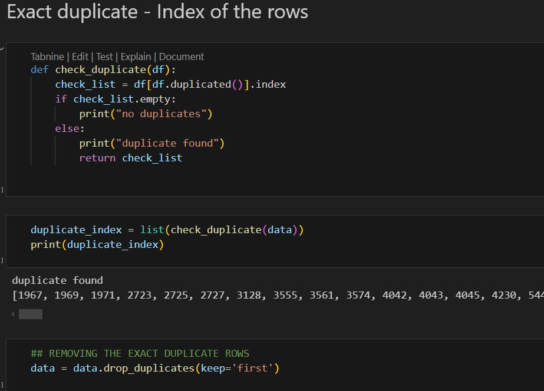
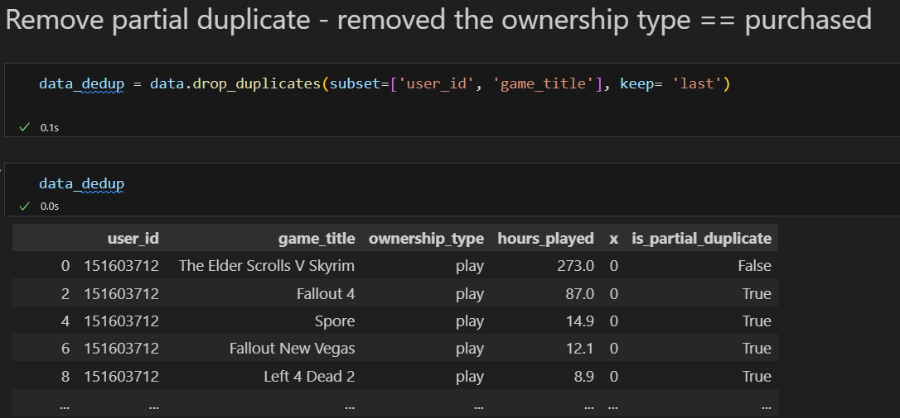

# Deduplication of Steam Video Game Dataset

## Overview
This project focuses on deduplicating a dataset containing Steam video game records. Duplicate entries can arise due to multiple listings, data entry errors, or inconsistencies in naming conventions. This notebook processes the dataset to remove duplicate records and ensure data integrity.

## Dataset
The dataset used in this project contains information about Steam video games, including details such as game titles, userid ownership type and hours played. The primary goal is to clean the data by identifying and removing duplicate entries.

## Requirements
This notebook requires the following dependency:
- **pandas** (for data manipulation and deduplication)

Ensure you have pandas installed before running the notebook:
```bash
pip install pandas
```

## Usage
1. Open the `Deduplication.ipynb` notebook in Jupyter Notebook or JupyterLab.
2. Load the dataset into a pandas DataFrame.
3. Apply deduplication techniques to remove redundant records.
4. Save the cleaned dataset for further analysis or visualization.

## Code Snippet
Here’s a simple code snippet demonstrating how to remove duplicates using pandas:
```python





## Output
After running the notebook, you will obtain a cleaned version of the dataset with duplicate records removed, ensuring accurate and reliable data for further processing.

## License
This project is for educational and research purposes. Modify and use it as needed.

